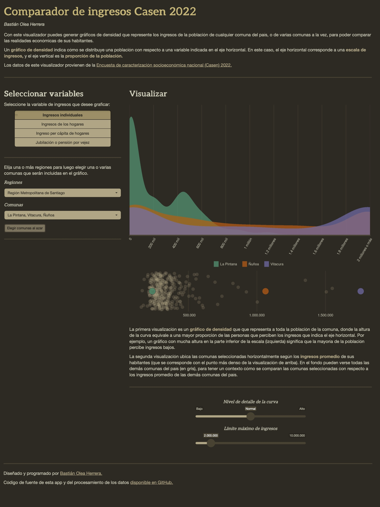

# Visualizadores de datos en R/Shiny

[Portafolio](https://bastianolea.github.io/shiny_apps/) de aplicaciones web de código abierto diseñadas y programadas por [Bastián Olea Herrera,](https://bastian.olea.biz/) magíster en sociología y *data scientist.*

Estas apps han sido desarrolladas usando el [lenguaje de programación estadística y de código abierto R,](https://www.r-project.org/about.html) bajo el paradigma de los paquetes [{tidyverse} para manipulación, limpieza y procesamiento de datos,](https://www.tidyverse.org/) junto al [paquete {shiny} para desarrollar aplicaciones web interactivas.](https://shiny.posit.co/)

El código de las aplicaciones está disponible en sus respectivos [repositorios GitHub](https://github.com/bastianolea?tab=repositories) incluendo todo el proceso de desarrollo, desde la descarga y limpieza de datos hasta el diseño de la interfaz de las apps.

La idea es que otras personas puedan usar estas aplicaciones libremente, y revisar el código para aportar o bien para aprender a programar en R, contribuyendo así a la comunidad de usuarios de R en Chile.

Puedes encontrar mi información de contacto en [mi sitio web.](https://bastian.olea.biz/) 

¡Cualquier duda o comentario es bienvenido!

_Clic en cualquier imagen para ir al visualizador correspondiente:_

